# Architecture — Kutu Digitizer

**Single EC2 instance · 4 Docker containers · same-domain routing**

---

## 1. System Architecture (Container-Level)

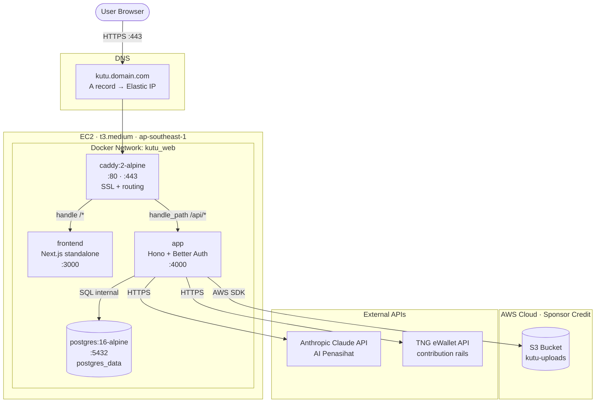

---

## 2. Request Flow — Create Tabung

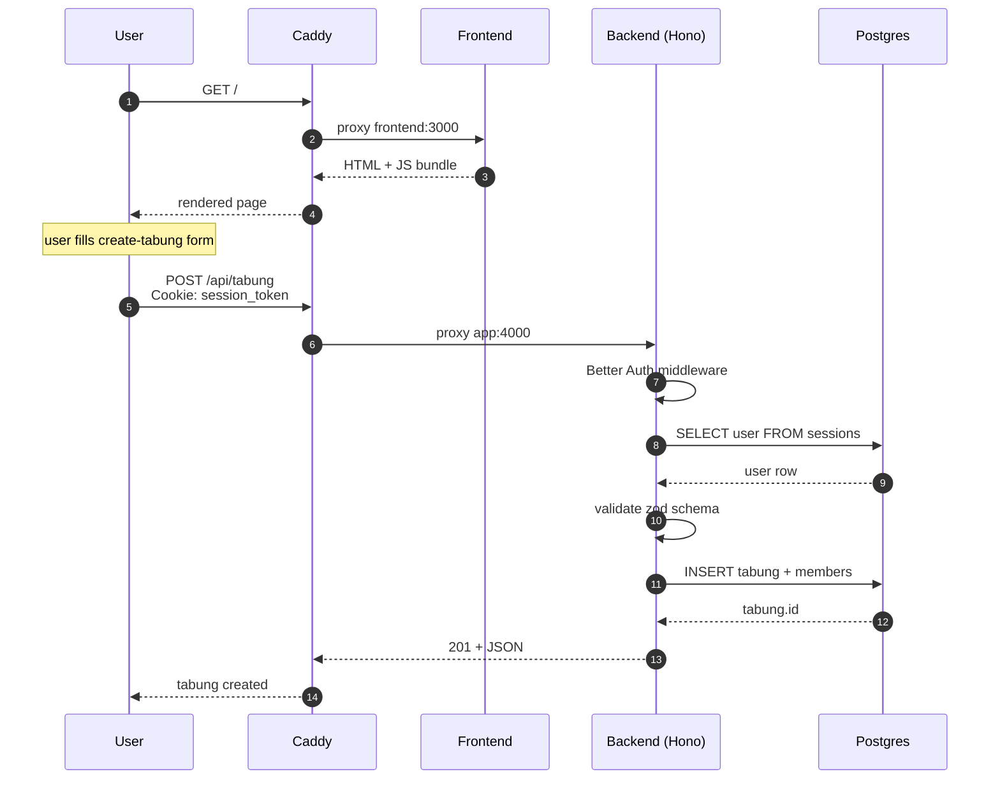

---

## 3. Auth Flow — Better Auth

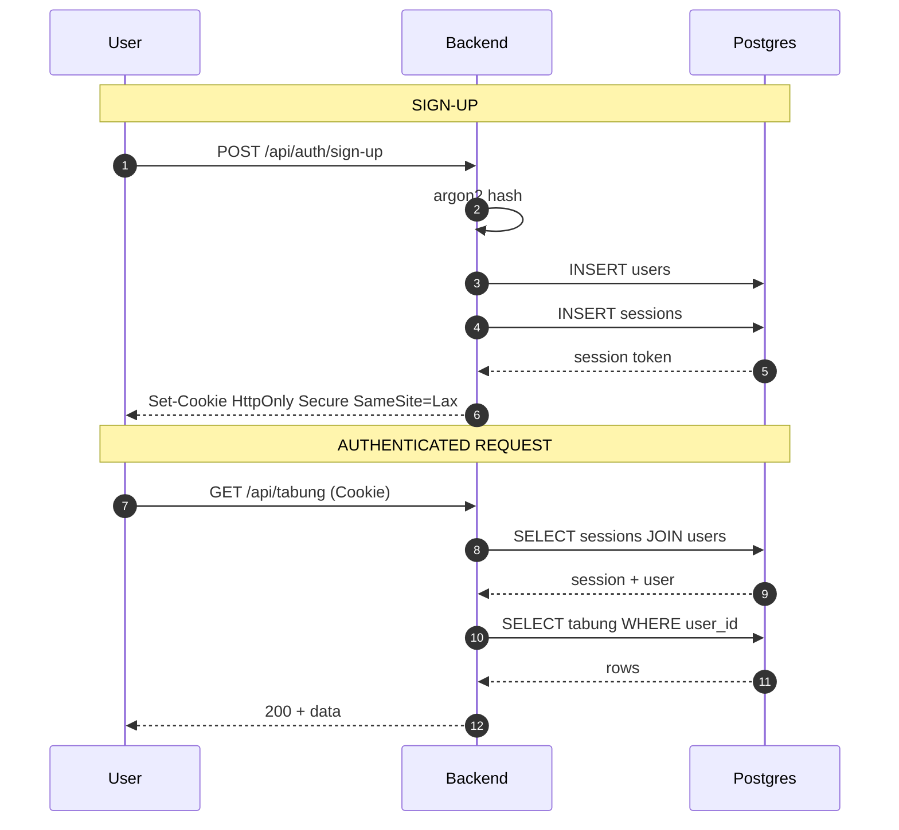

---

## 4. Contribution + Rotation Flow

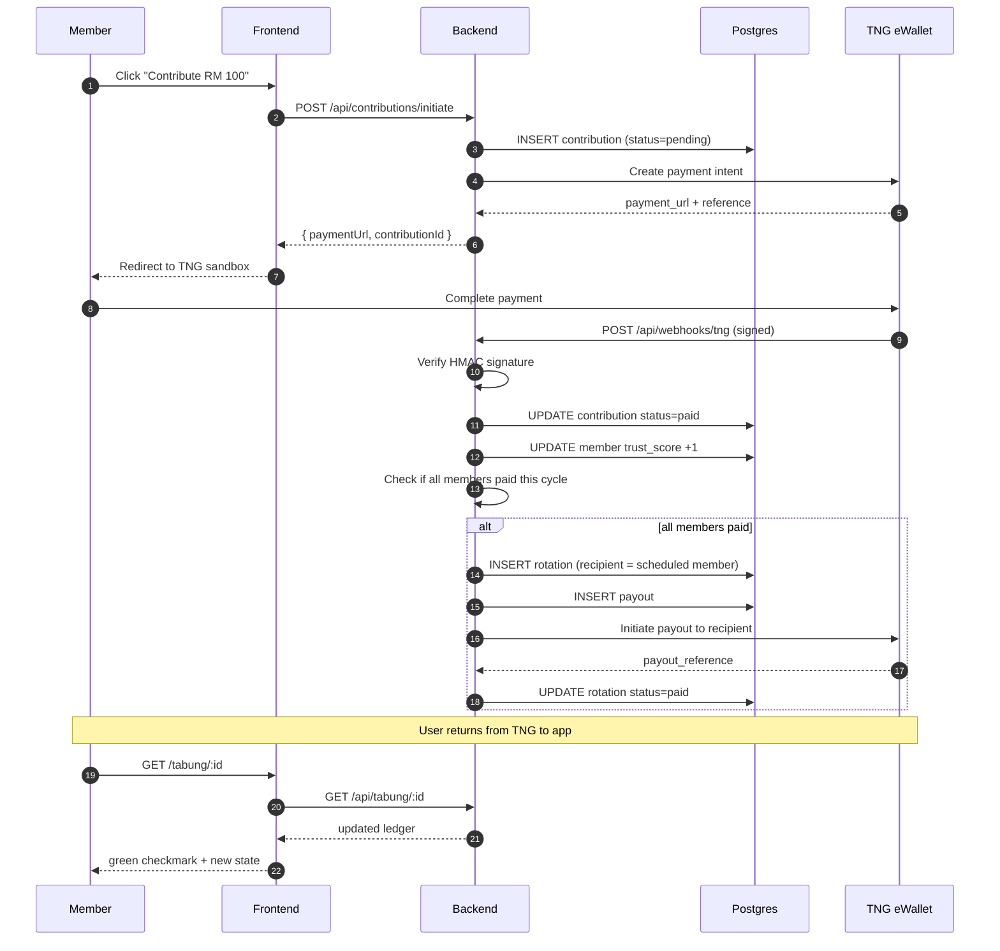

---

## 4b. Penasihat Robo-Advisor Flow (Innovation pillar)

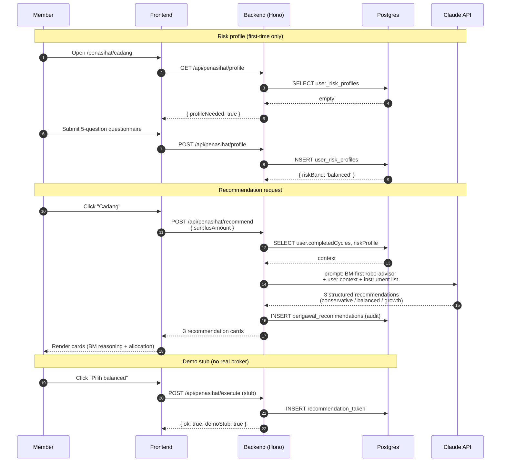

---

## 4c. Pengawal Scam Sentinel Flow (Security pillar)

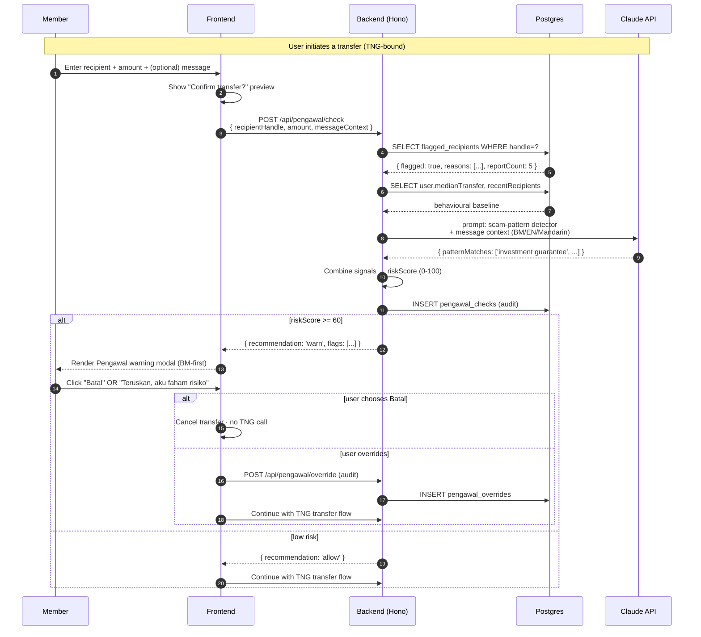

---

## 5. S3 Upload Flow (Presigned URL)

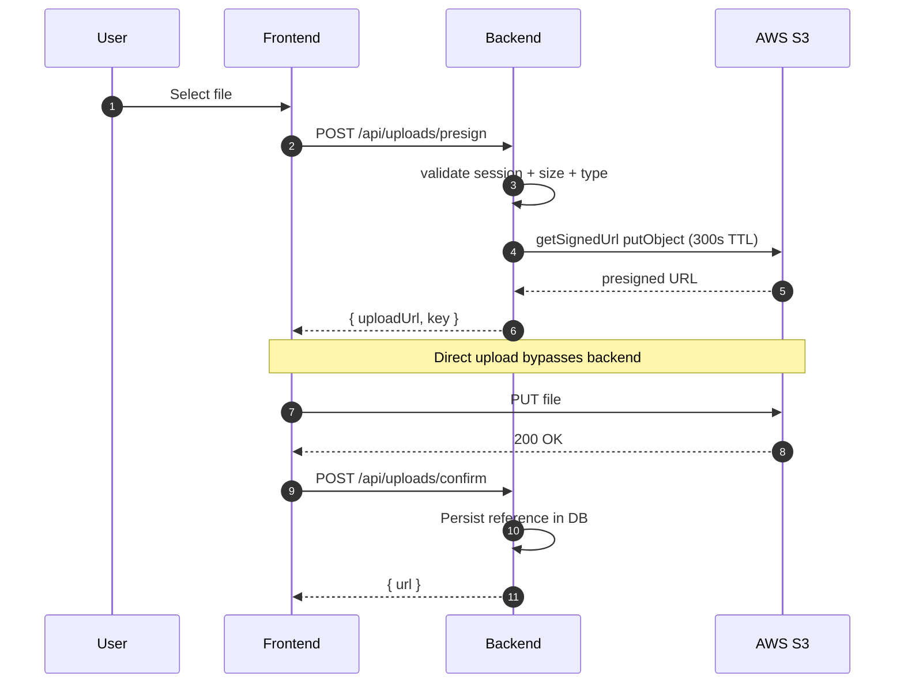

---

## 6. Dev vs Prod

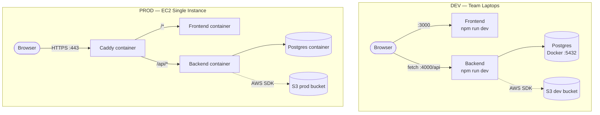

---

## 7. Deploy Pipeline

```mermaid
flowchart LR
    Dev[Dev Laptop] -->|git commit| Local[Local git]
    Local -->|git push| GH[(GitHub)]
    GH -->|SSH manual pull| EC2[EC2 Instance]
    EC2 -->|git pull| Pull[Updated code]
    Pull -->|docker compose up -d --build| Build[Rebuild images]
    Build --> Restart[Containers restart]
    Restart -->|db migrate| Migrate[Apply migrations]
    Migrate --> Live([Live])
```

Total deploy: ~90 seconds.

---

## 8. Data Model

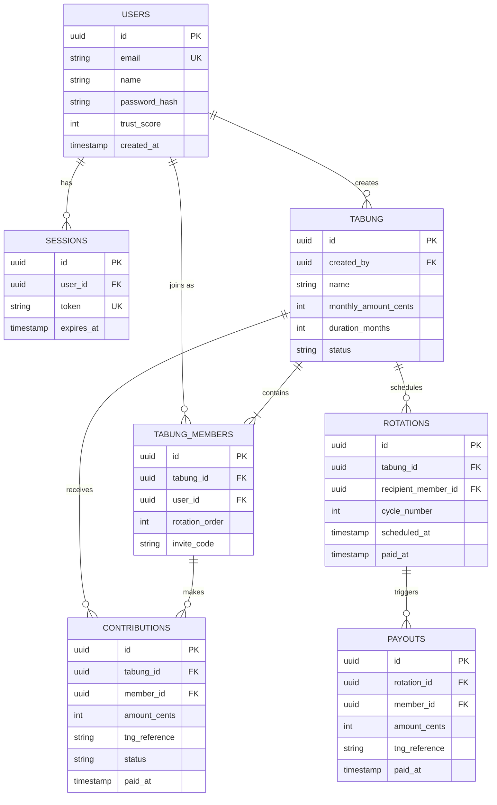

### Phase 5 additional tables (Innovation + Security pillars)

```mermaid
erDiagram
    USERS ||--o| USER_RISK_PROFILES : "has one"
    USERS ||--o{ PENASIHAT_RECOMMENDATIONS : "received"
    USERS ||--o{ PENGAWAL_CHECKS : "ran"
    USERS ||--o{ PENGAWAL_OVERRIDES : "overrode"
    FLAGGED_RECIPIENTS ||--o{ PENGAWAL_CHECKS : "matched in"

    USER_RISK_PROFILES {
        uuid user_id PK_FK
        string risk_band
        json questionnaire_answers
        timestamp updated_at
    }

    PENASIHAT_RECOMMENDATIONS {
        uuid id PK
        uuid user_id FK
        int surplus_amount_cents
        json recommendations
        timestamp created_at
    }

    FLAGGED_RECIPIENTS {
        uuid id PK
        string handle UK
        string flag_reason
        int report_count
        timestamp first_flagged_at
    }

    PENGAWAL_CHECKS {
        uuid id PK
        uuid sender_user_id FK
        string recipient_handle FK
        int amount_cents
        json signals
        int risk_score
        string recommendation
        timestamp checked_at
    }

    PENGAWAL_OVERRIDES {
        uuid id PK
        uuid check_id FK
        uuid user_id FK
        timestamp overridden_at
    }
```

Notes:

- `flagged_recipients` is seeded for demo (one known-bad handle for the on-stage Pengawal trigger). In production, the table is populated by community reports + scam list integrations.
- `pengawal_checks` is append-only audit. Every check leaves a row whether or not the user overrode the warning — regulator-friendly trail.
- `penasihat_recommendations.recommendations` is JSON for demo speed; in production it would normalize to a child table.

---

## 9. Network Security

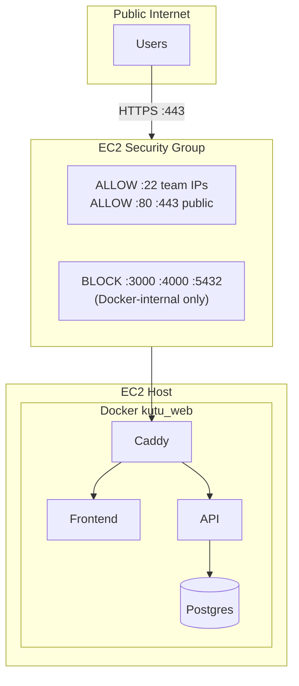

Postgres never exposed publicly. Only `app` container reaches it via Docker network.

---

## Container Inventory

| Container | Image | Public Ports | Internal Ports | Volumes |
|---|---|---|---|---|
| caddy | caddy:2-alpine | 80, 443 | — | caddy_data, caddy_config |
| frontend | custom (Next.js) | — | 3000 | — (stateless) |
| app | custom (Hono) | — | 4000 | — (stateless) |
| postgres | postgres:16-alpine | — | 5432 | postgres_data |

---

## Resource Footprint (t3.medium · 2 vCPU · 4 GB RAM)

| Container | RAM Idle | RAM Load |
|---|---|---|
| caddy | 15 MB | 30 MB |
| frontend | 120 MB | 250 MB |
| app | 80 MB | 200 MB |
| postgres | 40 MB | 300 MB |
| **Total** | **~255 MB** | **~900 MB** |

~3 GB RAM headroom remains.

---

## Render These Diagrams to PDF

```bash
cd /path/to/Kutu-Digitizer
npx -y -p @mermaid-js/mermaid-cli mmdc -i ARCHITECTURE.md -o ARCHITECTURE-rendered.md -e png --scale 2
sed -i '' 's/!\[diagram\]/![]/g' ARCHITECTURE-rendered.md
pandoc ARCHITECTURE-rendered.md -o ARCHITECTURE.pdf --pdf-engine=weasyprint
```

(See `/Users/ijam/Desktop/Touch-N-Go/style.css` for styling reference.)
