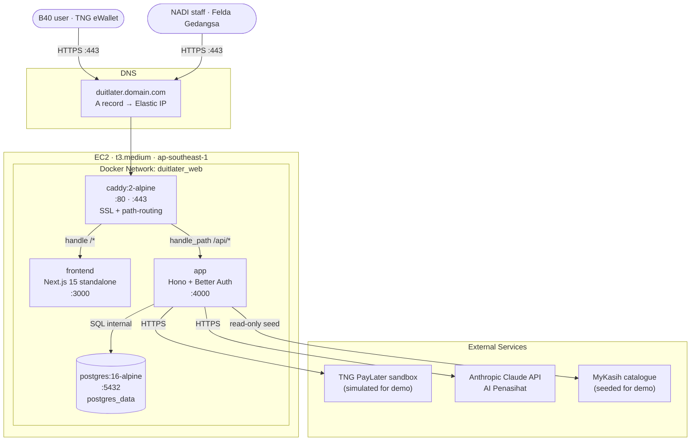
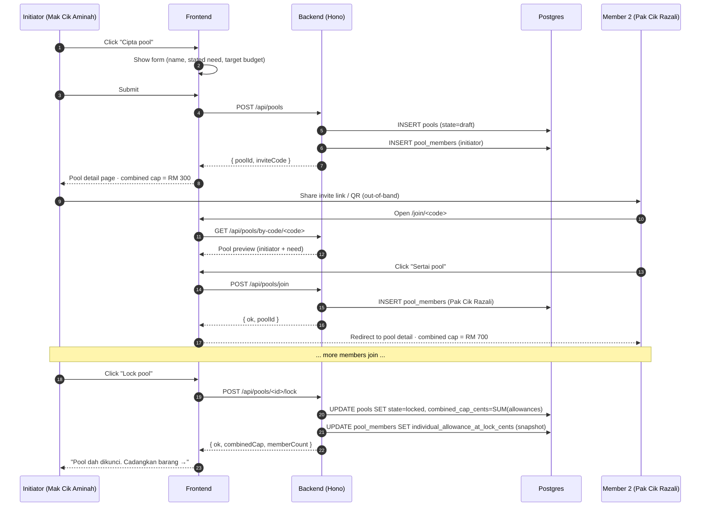
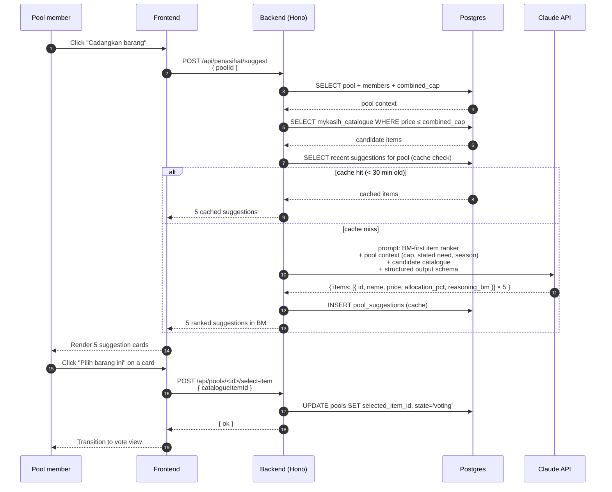
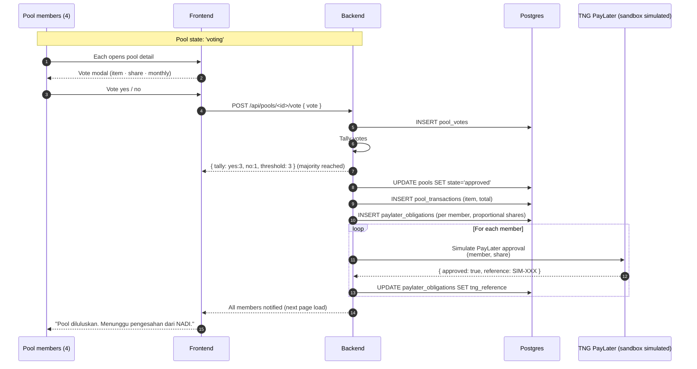
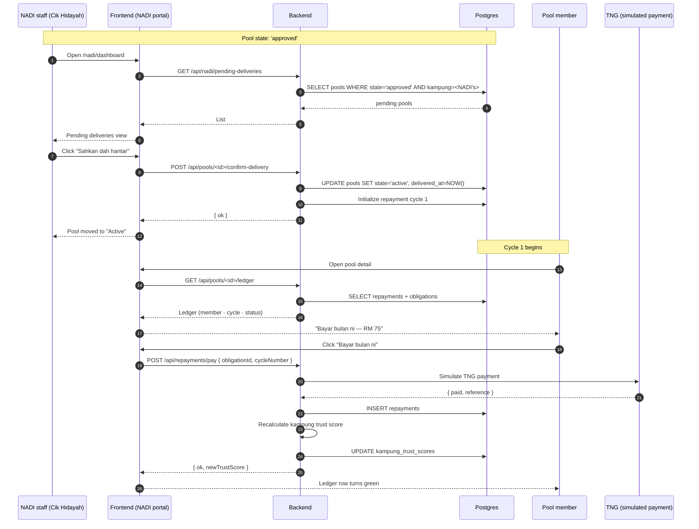
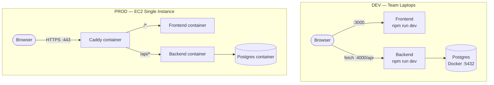
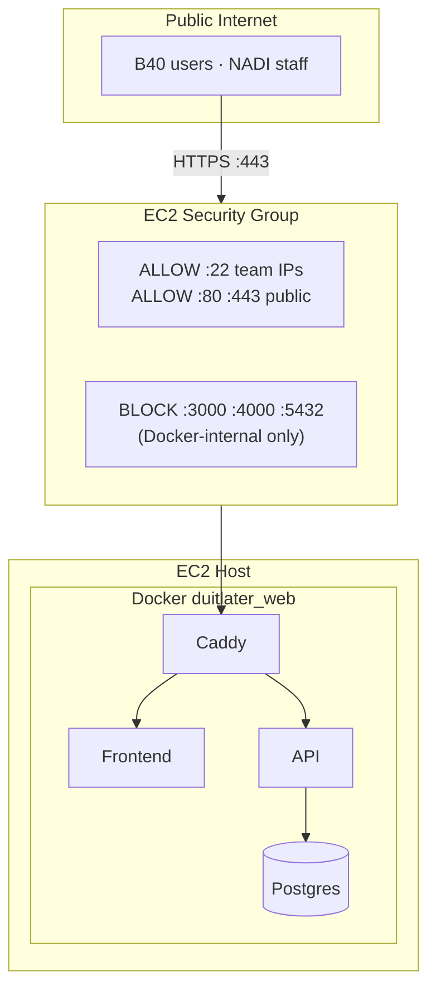

# Architecture — DuitLater

**Single EC2 instance · 4 Docker containers · same-domain routing · four-way Malaysian institutional integration**

---

## 1. System Architecture (Container-Level)



---

## 2. Pool Formation Flow



---

## 3. AI Penasihat Suggestion Flow



---

## 4. Pool Vote + Simulated TNG Approval Flow



---

## 5. NADI Confirm Delivery + Repayment Cycle



---

## 6. Dev vs Prod



---

## 7. Data Model

```mermaid
erDiagram
    USERS ||--o{ SESSIONS : has
    USERS }o--|| KAMPUNGS : "lives in"
    USERS ||--o{ POOL_MEMBERS : "joins as"
    KAMPUNGS ||--o{ POOLS : "hosts"
    KAMPUNGS ||--o| KAMPUNG_TRUST_SCORES : "has"
    POOLS ||--|{ POOL_MEMBERS : contains
    POOLS ||--o{ POOL_SUGGESTIONS : "received"
    POOLS ||--o{ POOL_VOTES : "voted on"
    POOLS ||--o| POOL_TRANSACTIONS : "results in"
    POOL_TRANSACTIONS ||--|{ PAYLATER_OBLIGATIONS : "split into"
    PAYLATER_OBLIGATIONS ||--o{ REPAYMENTS : "paid via"
    MYKASIH_CATALOGUE ||--o{ POOL_TRANSACTIONS : "purchased from"

    USERS {
        uuid id PK
        string email UK
        string name
        string password_hash
        uuid kampung_id FK
        int individual_paylater_allowance_cents
        string role
        timestamp created_at
    }

    KAMPUNGS {
        uuid id PK
        string name
        string nadi_centre_name
        string district
    }

    SESSIONS {
        uuid id PK
        uuid user_id FK
        string token UK
        timestamp expires_at
    }

    POOLS {
        uuid id PK
        uuid kampung_id FK
        uuid initiator_user_id FK
        string name
        string stated_need_text
        string stated_need_category
        int target_budget_cents
        int combined_cap_cents
        uuid selected_catalogue_item_id FK
        string state
        timestamp created_at
        timestamp locked_at
        timestamp delivered_at
    }

    POOL_MEMBERS {
        uuid id PK
        uuid pool_id FK
        uuid user_id FK
        int individual_allowance_at_lock_cents
        timestamp joined_at
    }

    MYKASIH_CATALOGUE {
        uuid id PK
        string name_bm
        string name_en
        string category
        int price_cents
        string image_url
        string description_bm
    }

    POOL_SUGGESTIONS {
        uuid id PK
        uuid pool_id FK
        json items_json
        timestamp suggested_at
    }

    POOL_VOTES {
        uuid id PK
        uuid pool_id FK
        uuid user_id FK
        uuid suggestion_item_id FK
        string vote
        timestamp voted_at
    }

    POOL_TRANSACTIONS {
        uuid id PK
        uuid pool_id FK
        uuid catalogue_item_id FK
        int total_amount_cents
        timestamp approved_at
        timestamp delivered_at
    }

    PAYLATER_OBLIGATIONS {
        uuid id PK
        uuid transaction_id FK
        uuid user_id FK
        int share_amount_cents
        decimal share_pct
        string tng_reference
    }

    REPAYMENTS {
        uuid id PK
        uuid obligation_id FK
        uuid user_id FK
        int cycle_number
        int amount_cents
        string tng_reference
        timestamp paid_at
    }

    KAMPUNG_TRUST_SCORES {
        uuid kampung_id PK_FK
        decimal score
        int signal_count
        timestamp last_updated_at
    }
```

### Key invariants

- Money columns are integer cents (never float)
- `pool.state` transitions forward only (`draft → locked → suggesting → voting → approved → active → completed | dissolved`)
- `pool.combined_cap_cents` set at lock time; never recalculated
- `pool_members.individual_allowance_at_lock_cents` is a snapshot (TNG may change individual allowances later; pool obligation uses snapshot)
- `paylater_obligations` rows are append-only after creation
- `repayments` are append-only; corrections via compensating rows, never destructive UPDATE
- `kampung_trust_scores` recalculated on every repayment or pool completion

---

## 8. Network Security



Postgres never exposed publicly. Only `app` container reaches it via Docker network.

NADI portal is a route within the same frontend (`/nadi/*`), gated by the user's `role` field. No separate domain or auth provider.

---

## Container Inventory

| Container | Image | Public Ports | Internal Ports | Volumes |
|---|---|---|---|---|
| caddy | caddy:2-alpine | 80, 443 | — | caddy_data, caddy_config |
| frontend | custom (Next.js) | — | 3000 | — (stateless) |
| app | custom (Hono) | — | 4000 | — (stateless) |
| postgres | postgres:16-alpine | — | 5432 | postgres_data |

---

## Resource Footprint (t3.medium · 2 vCPU · 4 GB RAM)

| Container | RAM Idle | RAM Load |
|---|---|---|
| caddy | 15 MB | 30 MB |
| frontend | 120 MB | 250 MB |
| app | 80 MB | 200 MB |
| postgres | 40 MB | 300 MB |
| **Total** | **~255 MB** | **~900 MB** |

~3 GB RAM headroom remains.

---

## External integration notes

- **TNG PayLater** — for hackathon, simulated client returns success. Production: TNG sandbox API integration. Exposed via single backend service `services/tng.ts` for clean swap-out.
- **Claude API** — `services/claude.ts` wraps Anthropic SDK. System prompt locked in `backend/src/prompts/penasihat-suggest.md` (committed for review).
- **MyKasih catalogue** — for hackathon, ~30 items seeded into `mykasih_catalogue` table from `backend/src/db/seeds/catalogue.ts`. Production: sync job from MyKasih Foundation API (when partnership established).
