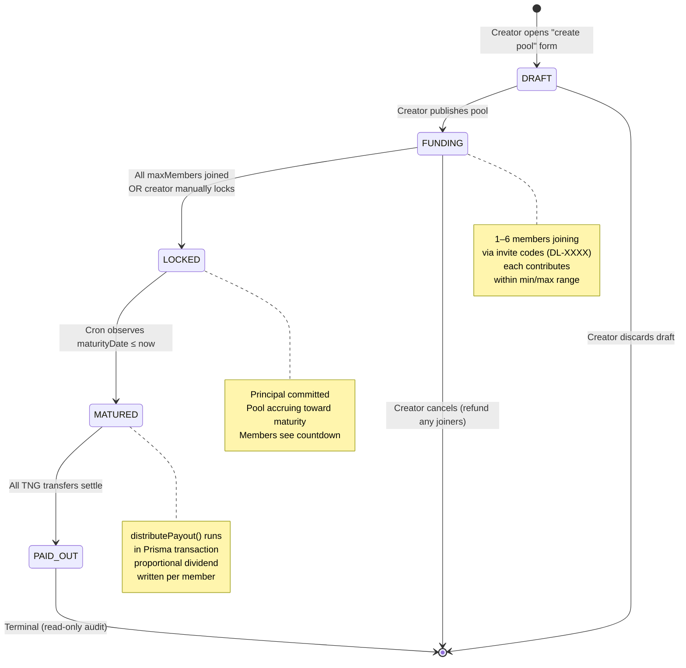
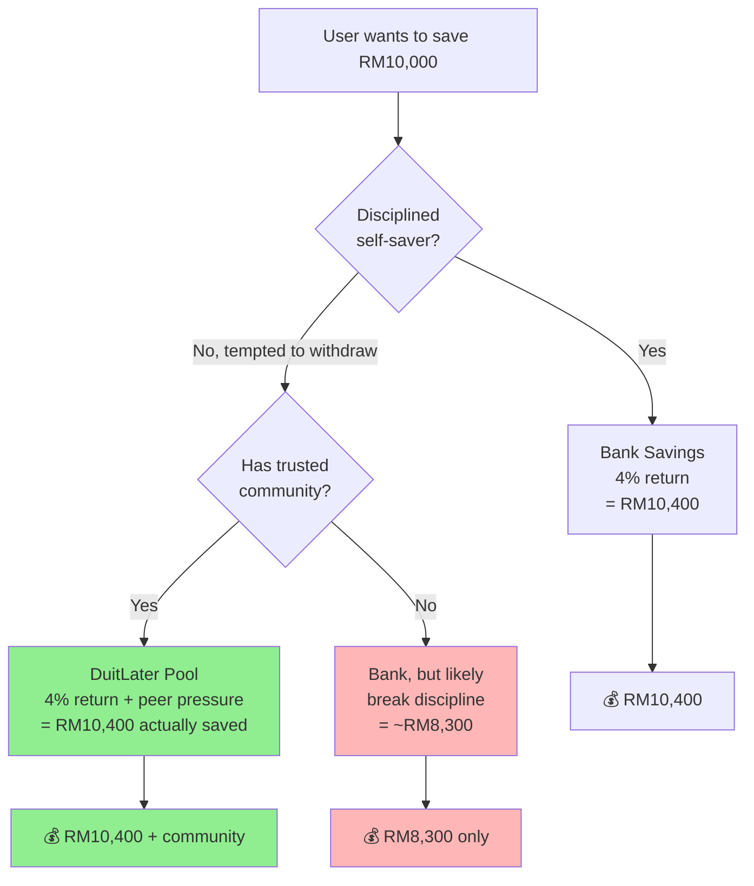
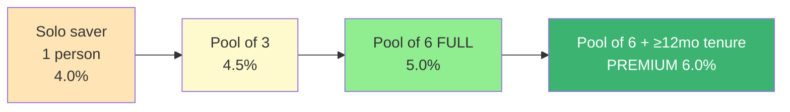
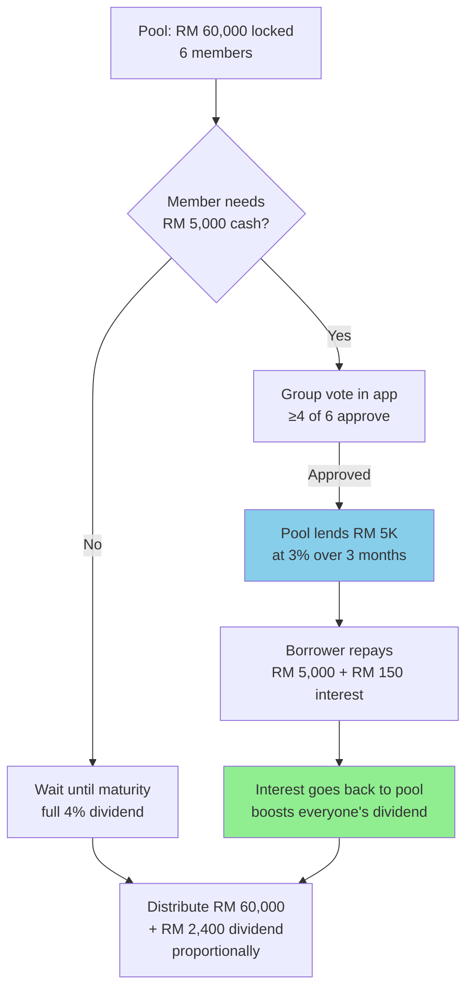
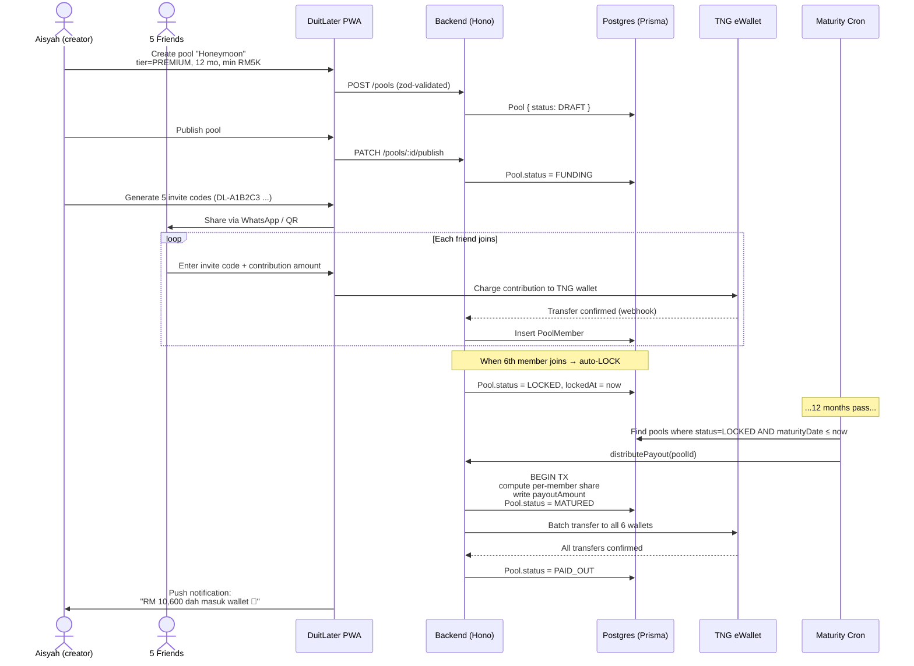
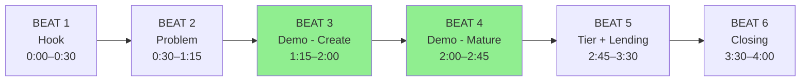

# DuitLater — Product Manifest

**Quest:** TNG FINHACK 2026 · Financial Inclusion · DuitLater Pool Investment
**Domain:** duitlater.com
**Last updated:** Imperial Day 499 (2026-04-25)
**Companion doc:** `01-tech-stack-manifest.md` (architecture & stack)

---

## Section 1 — One-Liner

> **DuitLater is a community pool investment platform.** Up to 6 people pool their savings, the pool earns a fixed dividend at maturity, and each member receives back their principal plus a share of the dividend **proportional to their contribution**.

**Tagline candidates:**
- *"Saving alone? Boring. Saving together? Berbaloi."*
- *"Tabung kawan-kawan, dividen sama-sama."*
- *"Your community is your bank."*

---

## Section 2 — Why DuitLater Exists

### The problem

Malaysian bank savings pay 0.25%–1% interest. Fixed deposits pay 2.5%–3.5%. Most people:

1. **Don't save** because returns feel pointless.
2. **Lack discipline** — savings get eaten by impulse spending.
3. **Are excluded** — no credit history, no formal employment, can't access proper investment products.
4. **Pay loan sharks** when emergencies hit (10–20% per month).

### The solution

A **digital chit fund / pool investment** where:

- Friends/family pool money together (up to 6 people)
- Pool earns a meaningful dividend (4% standard, up to 6% premium)
- Returns distributed **proportionally by contribution** (fair, not equal)
- Social commitment = harder to break savings discipline
- Optional collective lending unlocks cheap credit for members

This isn't a new financial product — *kutu, susu, tontine, chit funds* have existed in Asia for centuries. DuitLater **digitizes the trust layer** and integrates with TNG eWallet.

---

## Section 3 — Core Mechanics

### Pool definition

| Field | Description | Constraint |
|---|---|---|
| Name | Pool nickname (e.g. *"Tabung Sayang Mak"*) | 3–60 chars |
| Members | Up to 6 verified TNG users | 1 ≤ N ≤ 6 |
| Min contribution | Floor per member | e.g. RM500 |
| Max contribution | Ceiling per member | e.g. RM50,000 |
| Dividend tier | STANDARD (4%) or PREMIUM (6%) | Set at creation |
| Maturity period | 3, 6, 12, or 24 months | Locked at creation |
| Status | DRAFT → FUNDING → LOCKED → MATURED → PAID_OUT | State machine |

### Key rule changes from earlier draft

- ❌ ~~Each member must contribute the same principal~~
- ✅ **Members contribute different amounts within `[minContribution, maxContribution]`**
- ✅ **Dividend is split proportionally to contribution**, not equally

---

## Section 4 — Pool Lifecycle (Visual Flow)



---

## Section 5 — Payout Math (Proportional)

### Formula

```
totalPool         = Σ all members' contributions
dividendPool      = totalPool × dividendRate
memberShare       = dividendPool × (memberContribution / totalPool)
memberPayout      = memberContribution + memberShare
```

### Worked example — uneven contributions

```
Pool "Tabung Honeymoon"
Dividend rate: 4% (STANDARD tier)
Maturity: 6 months from lock

Members:
  Aisyah    → RM 10,000
  Bahir     → RM 15,000
  Chandran  → RM  8,000
  Dinesh    → RM  5,000
  Eshwari   → RM 12,000
  Faridah   → RM 20,000
  ─────────────────────
  Total     → RM 70,000

Dividend pool = RM 70,000 × 4% = RM 2,800

Per-member breakdown:
  Aisyah    contributed 14.29% → share = RM 400.00 → payout = RM 10,400
  Bahir     contributed 21.43% → share = RM 600.00 → payout = RM 15,600
  Chandran  contributed 11.43% → share = RM 320.00 → payout = RM  8,320
  Dinesh    contributed  7.14% → share = RM 200.00 → payout = RM  5,200
  Eshwari   contributed 17.14% → share = RM 480.00 → payout = RM 12,480
  Faridah   contributed 28.57% → share = RM 800.00 → payout = RM 20,800
  ──────────────────────────────────────────────────────────────────────
  Total payouts = RM 72,800 (= RM 70,000 principal + RM 2,800 dividend) ✓
```

**Why proportional matters:** removes free-rider risk. A member who contributes RM5K and one who contributes RM20K both earn the same effective rate (4%), but in absolute ringgit Faridah earns 4× what Dinesh earns — reflecting her 4× capital commitment.

### Edge case: integer cents

All math runs in **integer cents** to avoid floating-point drift. The remainder cent (if any) goes to the largest contributor. Kinetic owns the audit guard.

---

## Section 6 — Solo Saving vs Pool Saving

### When returns are equal (4% bank vs 4% pool)



### Concrete differences (RM)

| Saver type | Bank outcome | Pool outcome | Pool advantage |
|---|---|---|---|
| **Disciplined** | RM 10,400 | RM 10,400 | RM 0 (tied) |
| **Tempted to withdraw mid-term** | RM 8,320 (only RM8K saved) | RM 10,400 (peer pressure kept them in) | **+RM 2,080** |
| **Unbanked / no credit history** | RM 0 (can't open account) | RM 10,400 | **+RM 10,400** |
| **Hit by emergency** | Loan shark @ 15%/mo on RM2K = -RM 300/mo | Early-withdraw at 3% penalty = -RM 60 once | **+RM 240+/emergency** |

### Honest verdict

> **For a perfectly disciplined saver in a fully banked economy: no financial advantage if rates are equal.** DuitLater wins by:
> 1. **Behavioral lock-in** (you actually save the full amount)
> 2. **Community safety net** (cheap emergency credit from your pool)
> 3. **Inclusion** (works without credit history)
> 4. **Tier upgrades** (see Section 7 — disciplined savers in full pools earn MORE)

---

## Section 7 — Tier Rewards (How DuitLater Beats Bank Returns Even for Disciplined Savers)

### The lever: bigger pool = better rate



### Tier table

| Tier | Members | Tenure | Rate | RM10K outcome |
|---|---|---|---|---|
| Solo (bank baseline) | 1 | any | 4.0% | RM 10,400 |
| Small pool | 2–3 | ≥ 3 mo | 4.5% | RM 10,450 |
| Standard full | 4–6 | ≥ 6 mo | 5.0% | RM 10,500 |
| **Premium** | 6 (full) | ≥ 12 mo | **6.0%** | **RM 10,600** |

> **Why this works for disciplined savers:** they're rewarded for *recruiting* and *committing longer*. A disciplined saver with 5 friends earns RM 200 more per RM 10K vs solo bank — for the same behavior.

### Why tiers exist (business angle)

- Bigger pools = lower per-member ops cost (one cron run, one TNG batch) → margin lets us pay more
- Longer tenure = more predictable capital → DuitLater can deploy it into higher-yield instruments (sukuk, money market, P2P lending) → real yield to fund the dividend
- Full pools = strong network effect (every new member recruits ~5 more)

---

## Section 8 — Lending Hybrid (Future / V2 Pitch Angle)

The pool isn't just savings — it's a **community credit union**.



### Why this beats moneylenders

| Source | Rate | Cost on RM5K / 3 months |
|---|---|---|
| Loan shark (along) | 15% / month | RM 2,250 |
| Personal loan (bank) | 8% / year | RM 100 |
| **DuitLater pool** | **3% / 3 months** | **RM 150** |

Member saves vs loan shark, AND the interest stays inside the pool — strengthening the dividend for everyone.

---

## Section 9 — End-to-End User Journey



---

## Section 10 — Demo Narrative (4-min Pitch)



| Beat | Time | What happens on stage |
|---|---|---|
| **1. Hook** | 0:00 – 0:30 | "Bank savings pay 0.5%. Loan sharks charge 15%. There's a 30× gap your community already knows how to fill — *kutu, susu, tontine.* We just made it digital." |
| **2. Problem** | 0:30 – 1:15 | Show: 70% of Malaysians can't save RM1K for emergency. Existing chit funds are paper-based, no audit trail, run on trust alone. |
| **3. Live: create + invite** | 1:15 – 2:00 | Open PWA → create pool → generate invite code → second device joins via QR → both members visible. |
| **4. Live: maturity payout** | 2:00 – 2:45 | Admin "Trigger Maturity" button → cron path runs → Prisma Studio shows payouts written → TNG wallet balances update. **Kill wifi to show offline-tolerant PWA.** |
| **5. Tier + lending** | 2:45 – 3:30 | "Bigger pool = higher rate. Pool can lend internally at 3%, beating loan sharks." Show tier table + lending diagram. |
| **6. Close** | 3:30 – 4:00 | "Same returns as a bank, plus discipline, plus community safety net, plus financial inclusion. Built in 48 hours on TNG." Mic drop. |

---

## Section 11 — Open Questions (TBD with TNG sponsor mentor)

| # | Question | Owner | Deadline |
|---|---|---|---|
| Q1 | Final eligibility rules for STANDARD vs PREMIUM tier (member count + tenure thresholds) | Ijam + sponsor mentor | Saturday 12:00 |
| Q2 | TNG eWallet API — does it support batch transfers for payout? | Mahir | Saturday 14:00 |
| Q3 | KYC requirement — does each pool member need verified TNG account? | Mahir + Akal | Saturday 14:00 |
| Q4 | Lending feature scope — V1 demo only, or actually shipping? | Ijam | Saturday 18:00 |
| Q5 | Where does the dividend yield actually come from? (DuitLater margin? TNG fund? Sukuk?) | Ijam + Adam | Sunday 10:00 |
| Q6 | Early withdrawal mechanism — fixed % penalty or sliding scale by time-in-pool? | Kinetic | Sunday 12:00 |

---

## Section 12 — What We Are NOT Building (V1 Scope Discipline)

| Out of scope | Why deferred |
|---|---|
| Multi-currency pools | RM only for hackathon |
| Cross-pool transfers | Each pool is isolated |
| Public/discoverable pools | Invite-only — preserves trust narrative |
| Insurance against member default | TNG wallet pre-charge model means no default risk in V1 |
| Yield-bearing instruments (sukuk, P2P) | V1 dividend funded from DuitLater margin / sponsor demo budget |
| Compliance with Securities Commission | Out-of-scope for hackathon prototype; flag for post-hackathon |
| Social features (leaderboards, achievements) | Cut for V1 — focus on core flow |
| iOS / Android native apps | PWA-only — install prompt covers both |

---

## Section 13 — Success Metrics for the Pitch

The judges should walk away convinced of:

1. ✅ **The math is real** — proportional dividend math reconciles to integer cents on stage
2. ✅ **The tech ships** — PWA installs, works offline, syncs on reconnect
3. ✅ **The model scales** — tier system creates network effects (every new user recruits 5 more)
4. ✅ **The inclusion story is honest** — works for unbanked users via TNG eWallet
5. ✅ **The community angle differentiates** — bank can't offer peer pressure or group lending

---

*End of product manifest. Canonical seal: duitlater | product | day-499 | pool-investment | proportional-dividend | tiered-rewards | community-credit-union*
