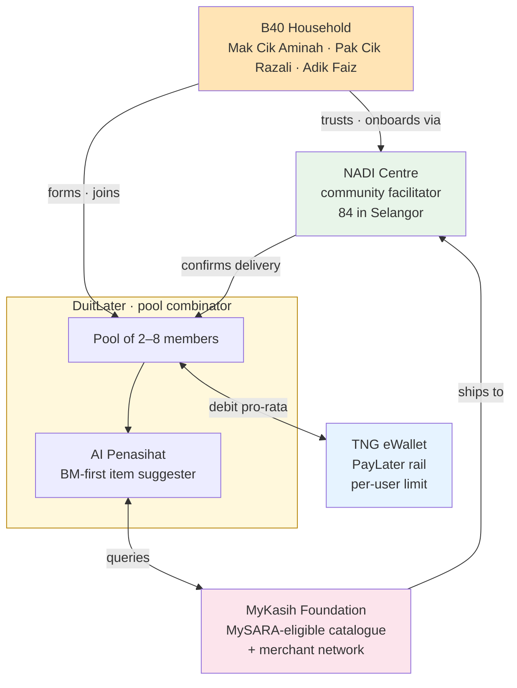
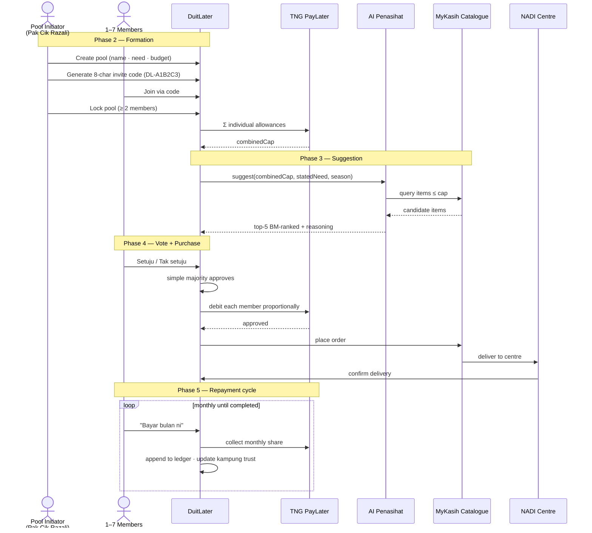
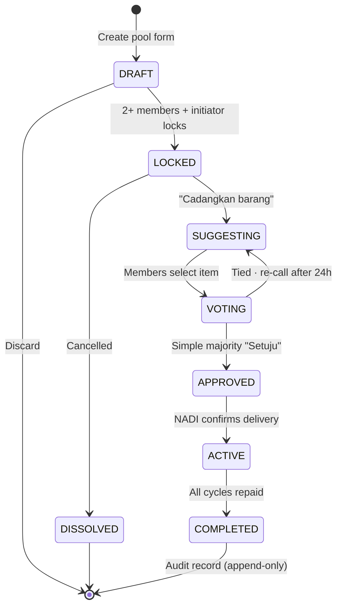
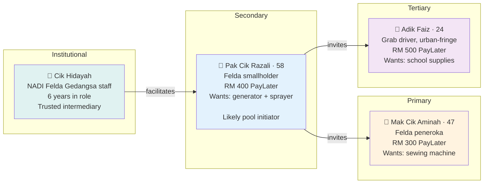
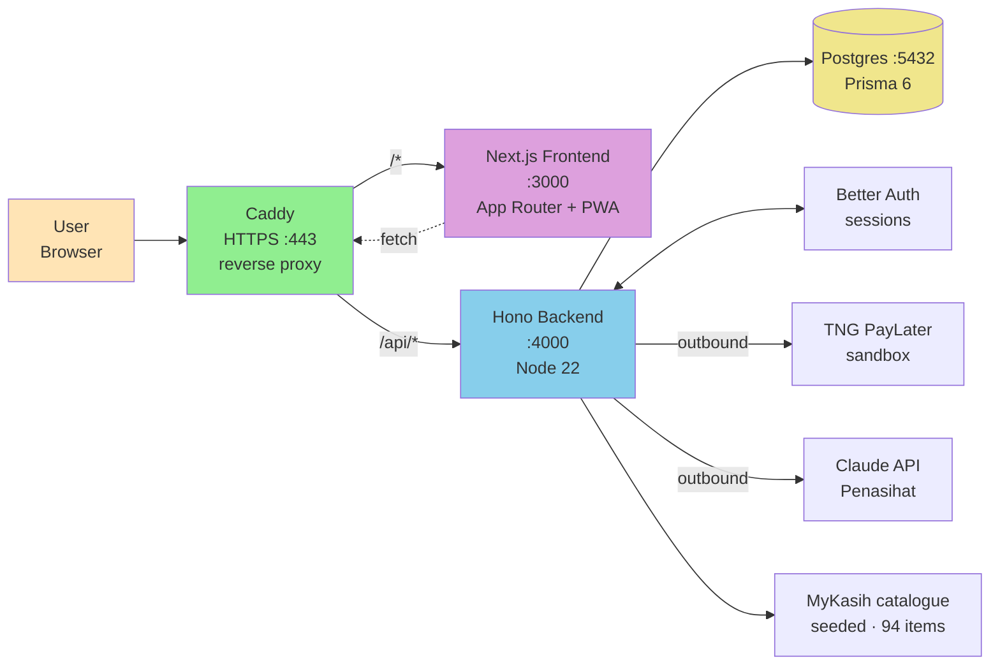
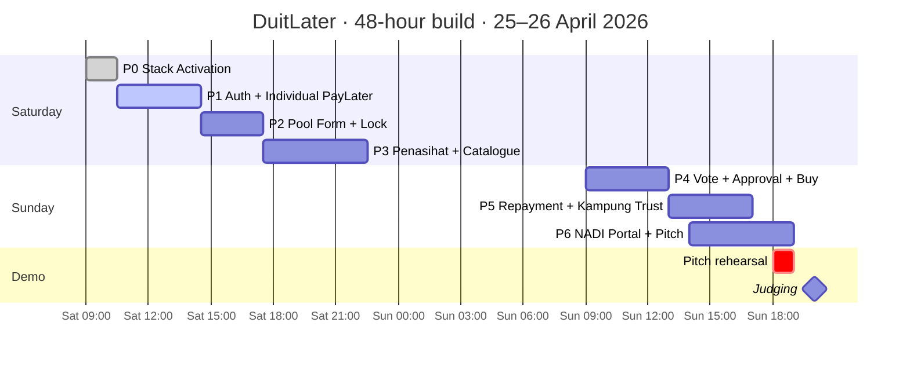
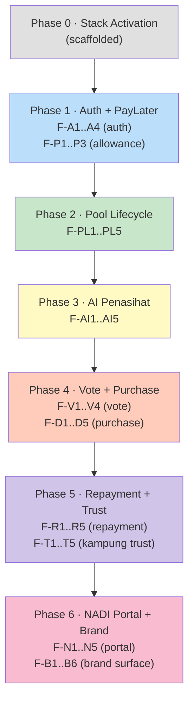
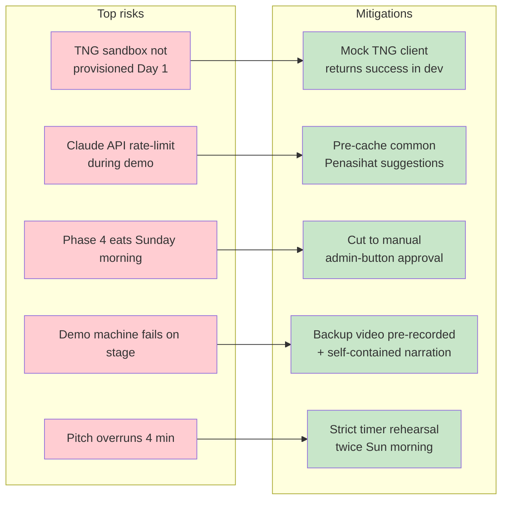
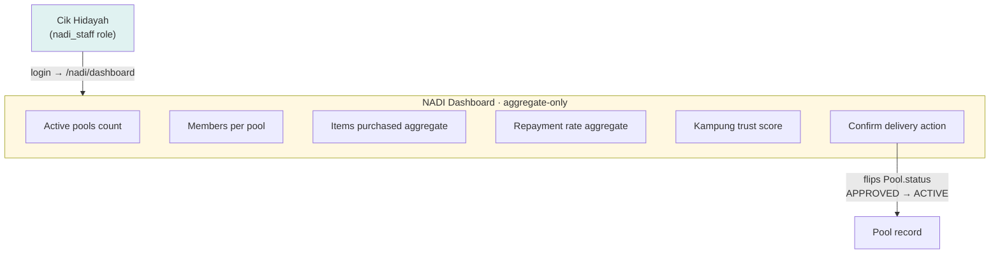
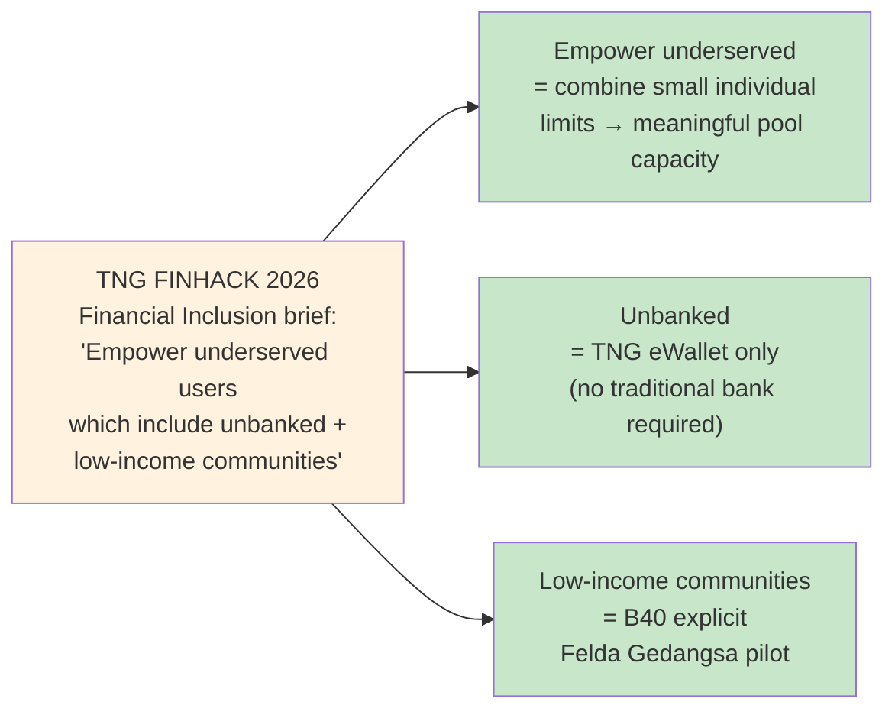

# DuitLater — PRD Visual Flow

**Companion to `PRD.md`** — same product spec, expressed as flow diagrams for fast comprehension during pitch, stand-up, and handoff.

**Source of truth:** [PRD.md](./PRD.md). If diagrams here disagree with the PRD, the PRD wins.

---

## 1. The Institutional Package (4-way Malaysian)



**Key insight:** zero new institutions invented. Every actor already exists in Malaysia today. DuitLater is the *missing connector*.

---

## 2. End-to-End User Journey



---

## 3. Pool Lifecycle (state machine)



| State | Mutations allowed | Owner |
|---|---|---|
| `DRAFT` | Edit any field | Initiator |
| `LOCKED` | Roster frozen · combinedCap fixed | TNG |
| `SUGGESTING` | Penasihat queries Claude API | AI |
| `VOTING` | Each member votes once | Members |
| `APPROVED` | TNG debits committed | TNG + Backend |
| `ACTIVE` | Monthly repayments accrue | Members + NADI |
| `COMPLETED` | Read-only audit | None |

---

## 4. Personas at a Glance



**Common patterns:** TNG already installed · BM-first · trust through community (kampung + NADI staff) · excluded from formal credit · included in MySARA aid.

---

## 5. Pool Math — Worked Example

```
Pool: "Mesin Jahit Felda Gedangsa"
Members + individual TNG PayLater allowances
─────────────────────────────────────────────
  Mak Cik Aminah     RM   300
  Pak Cik Razali     RM   400
  Adik Faiz          RM   500
  3 others (avg)     RM 1,200 (RM 400 each)
                     ─────────
  combinedCap:       RM 2,400

Item chosen by majority vote: Industrial sewing machine RM 1,800
Proportional debit per member:

  Aminah   →  300 / 2400 × 1800 =  RM 225.00
  Razali   →  400 / 2400 × 1800 =  RM 300.00
  Faiz     →  500 / 2400 × 1800 =  RM 375.00
  Other-1  →  400 / 2400 × 1800 =  RM 300.00
  Other-2  →  400 / 2400 × 1800 =  RM 300.00
  Other-3  →  400 / 2400 × 1800 =  RM 300.00
                                  ─────────
  Total committed:                RM 1,800.00  ✓

Monthly share over 6 cycles:
  Aminah   →  RM  37.50 / month
  Razali   →  RM  50.00 / month
  Faiz     →  RM  62.50 / month
  Others   →  RM  50.00 / month each
```

**Invariants** (`PRD §10` + `§12`):
- All money in **integer cents** — never float
- Repayment ledger **append-only** — corrections via compensating rows
- `Pool.combinedCap` **frozen at lock** — never recalculated

---

## 6. Tech Architecture



**Repository layout — pnpm workspace monorepo:**

```
R2-D2-Finhack/
├── packages/
│   ├── backend/    Hono · Prisma · Better Auth · zod
│   ├── frontend/   Next.js 15 · Tailwind v4 · Jotai · TanStack Query · PWA
│   └── db/         Prisma schema · migrations · generated client
├── docs/{product,tech,team,process,pitch}/
├── maji-core/      protocols · heroes · slash commands
└── infra/ (Caddyfile + compose) · scripts/
```

---

## 7. Build Phases Timeline (48-hour window)



| Phase | Lead | Testable outcome |
|---|---|---|
| 0 | Moon + Akmal · Kairu gate | `docker compose up` · `/health` returns 200 · landing renders |
| 1 | Moon + Akmal | Register → login → dashboard shows individual PayLater allowance |
| 2 | Akmal + Moon | Create pool → invite → 2nd user joins → lock → combinedCap visible |
| 3 | Moon | Locked pool → Penasihat returns top-5 BM-ranked items |
| 4 | Moon + Kairu | Members vote → majority approves → simulated TNG debit → ACTIVE |
| 5 | Moon + Akmal | Monthly Bayar → ledger appends → kampung trust score updates |
| 6 | Ijam + MatNep | NADI portal · pitch deck · 4-min on-stage rehearsal |

---

## 8. Functional Requirements Coverage by Phase



---

## 9. Risk → Mitigation Map



---

## 10. NADI Portal Scope (F-N1..N5)



**Privacy guarantee (F-N5):** NADI staff see *aggregate* numbers — never individual member amounts or transactions.

---

## 11. Track-fit Recap (Financial Inclusion)



---

*PRD-flow v1.0 · 2026-04-25 · derived from PRD v2.0 · companion visualisation for the same Financial Inclusion track submission.*

*"Sendiri tak mampu, ramai-ramai boleh."*
